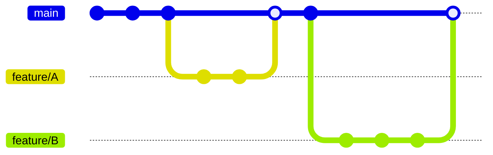

# Vue3 Typing Game

## 環境構築手順
```
// VSCode拡張機能のDev Containersを導入後
Win: Shift+Ctrl+P
Mac: Shift+Command+P
から
open folder in container
を選択してリモートコンテナ内で作業を行う
```

## ブランチ運用
GitHub Flowに従う。


## コンテナ内コマンド
```
開発サーバ起動（ホットリロード対応）
yarn dev

テスト
yarn test

ビルド
yarn build

プレビュー(要ビルド)
yarn preview
```